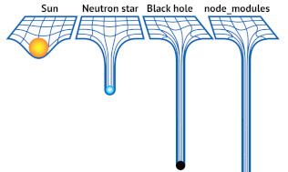
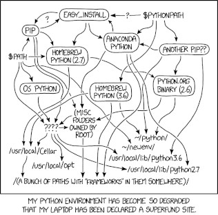

`dropboxignore` is a CLI tool which supports a collection of commands in order to make your life easier when it comes
to exclude files or/and folders from :material-dropbox: dropbox sync. Below you will find some common usecases.

## A typical workflow

A common workflow could be the following:

 1. Automatically generate `.dropboxignore` files based on existing `.gitignore` files.
 2. Manually update or create `.dropboxignore` files (Optional).
 3. Ignore matched files based on .dropboxignore files.

and you can run this flow by running the following command:

```shell
$ dropboxignore genupi .
```

!!! warning "Important warning"
    In order to prevent unpleasant data losses, exception patterns are not supported. Both `.gitignore` and
    `.dropboxignore` files with at least one exceptional pattern will be bypassed (for further details:
    [#3](https://codeberg.org/sp1thas/dropboxignore/issues/3)).

!!! note "Keep in mind"
    Automatic generation of `.dropboxignore` files is an optional step, therefore, may not be a necessary action for
    your case.


## Long story short

Below you will find some of the most common cases that dropboxignore could be useful.

=== "Node.js"

    
    ```shell
    $ dropboxignore ignore ./node_modules
    ```

=== "Python"

    
    ```shell
    $ dropboxignore ignore ./venv
    $ dropboxignore ignore *.pyc
    ```

=== "Tex"

    ```shell
    $ dropboxignore ignore *.aux
    ```

=== "Jetbrain"

    ```shell
    $ dropboxignore ignore .idea/
    ```

=== "VS Code"

    ```shell
    $ dropboxignore ignore .vscode/
    ```
